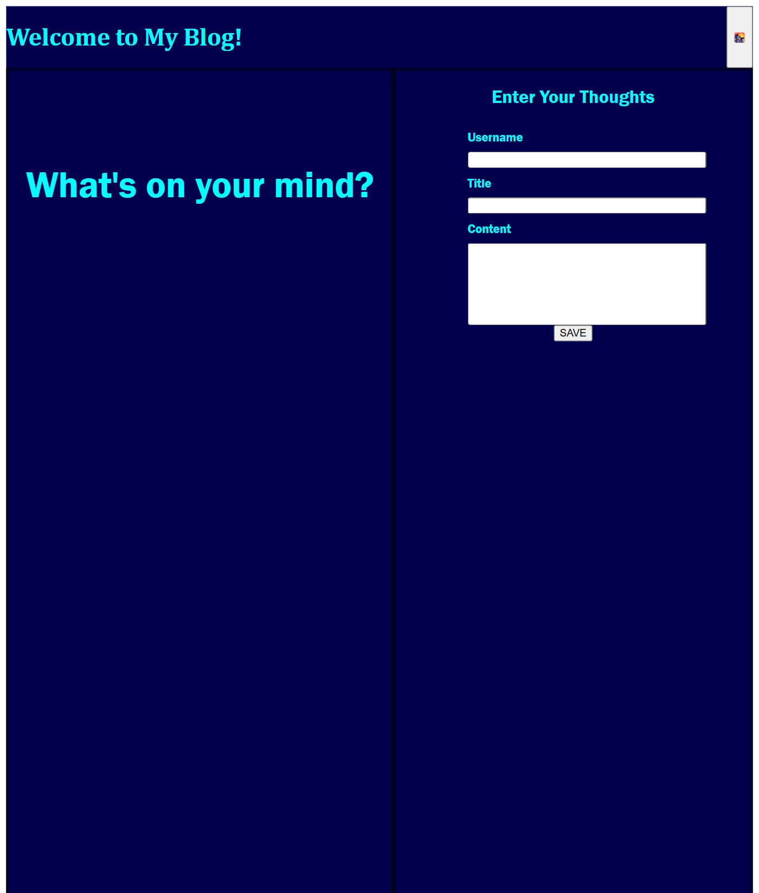
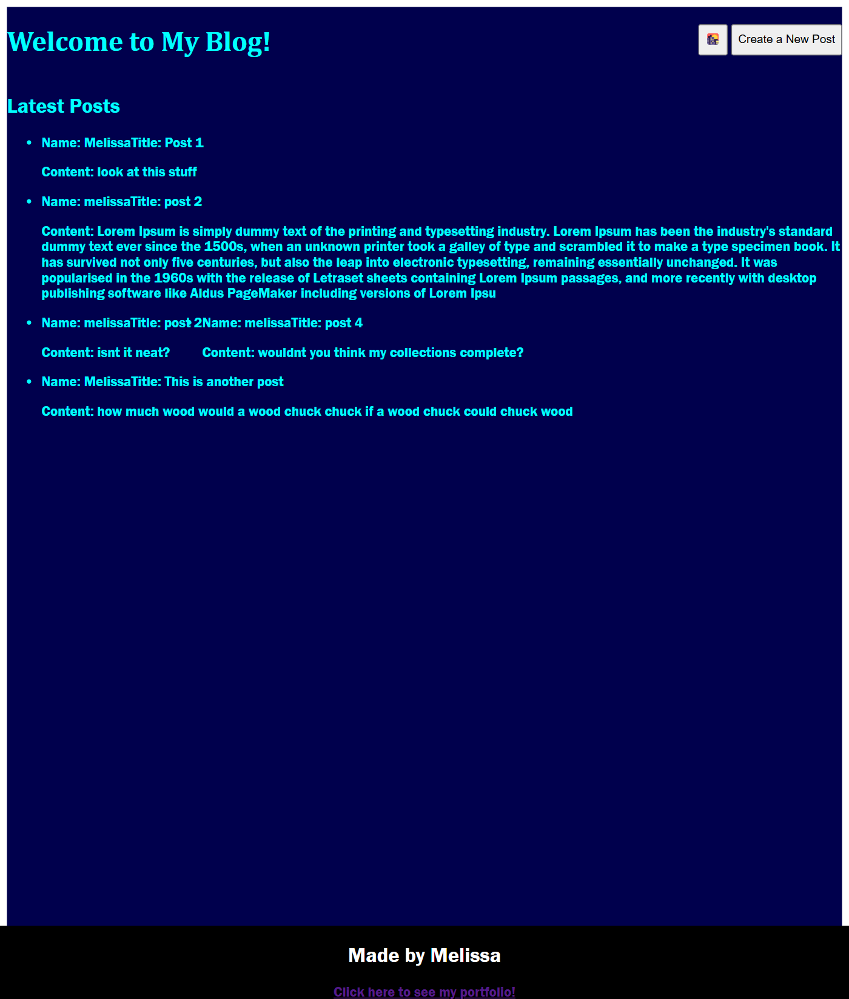

# challenge-4-blog

## Description

This project is a blog webpage for a marketing student. It uses javascript to log blog entries into local storage that can then be seen on a separate page. It also includes a light/dark mode function that can change the styling based on need. 

## Usage

This page can be used to log experiences and then refer back to them. A user can add a post, view their previous posts, and add additional posts. It could also potentially be used by multiple people logging info to be viewed as part of a collaboration. 

https://melivesel.github.io/challenge-4-blog

## Credits

https://stackoverflow.com/questions/10868640/align-html-input-fields-by
UT Bootcamp Xpert Learning Assistant and UT Bootcamp Learning Materials
https://www.lipsum.com/

## License

Please refer to the license referenced in the repo
